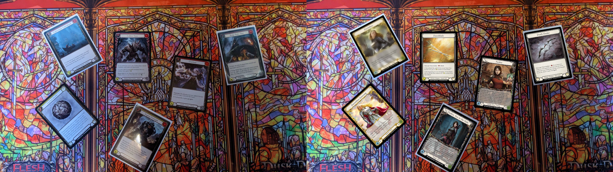

# FAB Template Generator
The goal of this project to aid [YOLO](https://docs.ultralytics.com/) dataset creation for card detection in Flesh and Blood, an ever-changing competitive card game. While most professional games are streamed live, it can be confusing for new players who don't know all the cards yet.

---

### About this project 
YOLO (You Only Look Once) is an object detection algorithm that has gained significant popularity due to its speed and accuracy. It allows us to detect and classify objects within an image or video.

YOLO is an amazing tool, but did you know that to train it, you will need a *couple* of images? How many? It's hard to tell as it varies on many factors. Generally, the more, the better. For the best results with one object category, you would need around ***1500-4000 images***. With a game that has over 2100+ cards, you would need at least 2,100,000 images. Additionally, you need to draw boundary boxes around the objects, which would take ages by hand.

What else can we do then? We can generate real-life scenario images. We can warp the images to their positions and augment them. However, the validation dataset can't be fully automated, or it would lose its purpose. We still need to do that manually, but we will need to take far fewer images. For example, you can fit 10 cards in an image, in which case 210 would be enough. You would still want to take at least 3-5 different photos of each individual card, but even then, it's only 600-1000 images.


*An example output. On the left side you can see the template and on the right side the output with images over the template. Also in this example a blur was applied to the top-left card.*

---

### Requirements
The project uses the following libraries and those will be required to build.
- [Qt 5.0+](https://www.qt.io/)
- [OpenCV 4.0+](https://opencv.org/)
- [libzip](https://libzip.org/) which depends on [zlib](https://www.zlib.net/)

*Note: The project is developed under the use of linux system ([Pop!_OS](https://pop.system76.com/)) so the CMAKE is only set up to that system only. For now there is no guarantee that you will be able to build and run it over on Windows.* 

### Usage
1. ***The input***
You will need 2 things: A template and the images you want to overlay on top of that. The template requires a special format, it's a zip file that **must contain an image and json file exactly named as** `image.[jpg/png/...]` and `image_data.json`. The `image_data.json` contains the coordinates where the cards are located in the template. Follow the structure you see in the given [example](https://github.com/KuKetto/FABTemplateGenerator/tree/main/examples/templates).

2. ***How to use it in code?***
The main useage is extremly simple, we load a template and a number of required images. Then we can augment an image if we would like to and call the overlay function. That's it!
```
    // First we need to load the template image.
    Image template_image;
    template_image.set_file_path("YOUR TEMPLATE PATH /template/image.zip");
    template_image.open();

    // Set the image as template, we will get the number of required images returned.
    ImageOverlay overlay;
    unsigned short required_image_count = overlay.set_template_image(&template_image);
    qDebug() << required_image_count; // Output: 6

    // Open the images we want to overlay with.
    QVector<Image*> inputs;
    for (int i = 0; i < required_image_count; i++) {
        inputs.push_back(new Image());
        inputs[i]->set_file_path("YOUR INPUT IMAGE PATH /input/input" + std::to_string(i+1) + ".webp");
        inputs[i]->open();
    }

    // To make the dataset flexible we need much data
    // of one singular item (card) and we also need to augment it.
    Augmentation augmentation;
    augmentation.apply_bilateral_blur(inputs[1], 43, 200, 64);

    // Set the inputs and overlay
    overlay.set_images_to_overlay(inputs);
    cv::Mat result = overlay.overlay();

    // Write the output to your destination path
    std::vector<int> compression_params;
    compression_params.push_back(cv::IMWRITE_JPEG_QUALITY);
    compression_params.push_back(40); // Adjust the quality value as per your requirements (0-100)

    cv::imwrite("YOUR OUTPUT IMAGE PATH /output/output.jpg", result, compression_params);

    qDebug() << "Finished!";

    // Dynamic memory deallocation - the close method is called inside the destructor
    template_image.close();
    for (auto& input_image : inputs) delete input_image;
```

---

#### Roadmap

- [x] Opening templates and overlaying on top of them
- [ ] Augmenting:
    - [x] Blurs and noise
    - [ ] Cut out and flip
    - [ ] Brigtness and RGB shift augmentation
- [ ] Image labeling
- [ ] Config file to generation rules
- [ ] Automated generation just by running the project
- [ ] Code optimalization and testing
- [ ] Manual dataset creation:
    - [ ] Templates
    - [ ] YOLO validation dataset - at least 3 images of each invidual card